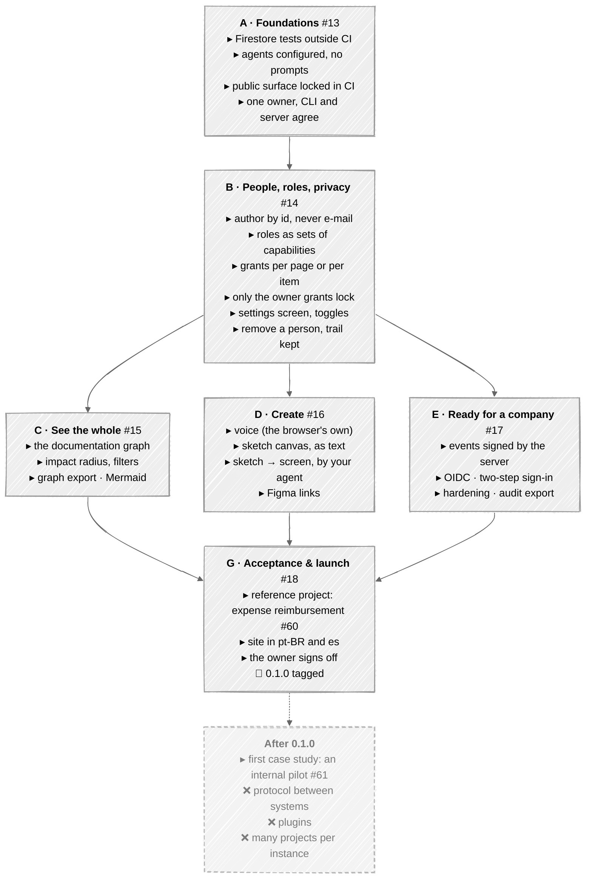

# Roadmap

Where Holdrim is going, in the order it is being built. The mission and the vision behind it are in
[`docs/VISION.md`](docs/VISION.md); what already works is in the [README](README.md), and what each
release changed is in [`CHANGELOG.md`](CHANGELOG.md).

A line moves to the changelog when it ships, not when it starts. Nothing here is a promise of a
date: it is the order, and the reason for the order.

## Now — 0.1.0, the first version worth pinning

One release, and it ships only when it is usable end to end and the owner has accepted it: an
adopter who pins it builds on it, so it has to deliver the whole method, not a start of one. Fixes
after that are 0.1.x. The plan is tracked in issue #12, one issue per pull request.

An arrow means "built after". **B** goes first because it changes the event format: nothing should
write new kinds of event before that. **C**, **D** and **E** only read or extend what B leaves, in any
order. Nothing is released before **G**. The letter **F** is the platform, after 0.1.0.

| Phase | What it delivers | Design |
|---|---|---|
| **A · Foundations** | the Firestore tests outside CI; the agents that build Holdrim itself working unattended; the public surface locked in CI; one owner, the same for the CLI and the server | — |
| **B · People, roles, privacy** | a person named by an id, never an e-mail; roles as sets of capabilities, granted per page or per item; only the owner grants `lock`; a lock written when it is given; a settings screen; feature toggles; removing a person without losing the trail | [`docs/ROLES.md`](docs/ROLES.md), [`docs/PRIVACY.md`](docs/PRIVACY.md) |
| **C · See the whole** | the documentation as a graph, coloured by the traffic light; the impact of touching a block; the graph exported from the CLI; proposed dependencies; diagrams drawn | [`docs/IMPACT.md`](docs/IMPACT.md) |
| **D · Create** | dictating a request by voice (the browser's own recognition); a sketch canvas saved as text, under the traffic light; a sketch turned into a screen by the person's own agent; design links | [`docs/VISION.md`](docs/VISION.md) |
| **E · Ready for a company** | events signed by the server; OIDC and two-step sign-in; hardening; an audit export | [`docs/PRIVACY.md`](docs/PRIVACY.md) §3 |
| **G · Acceptance & launch** | a reference project anyone can copy (expense reimbursement); the site in Portuguese and Spanish; the owner's acceptance; the release | — |

### Already built

- ✅ Approvals that stop holding when the text changes (🟡) or when what it depends on moves (🔴).
- ✅ The review panel inside the documentation's own pages, and the CLI for the same checks.
- ✅ Sign-in with passwords or behind an identity proxy; one owner; users in SQLite, Postgres or
  Firestore.
- ✅ The request cycle: a reviewer asks, the owner triages, the person's own agent applies, the
  commit closes it. The engine calls no model and holds no key.
- ✅ English, Portuguese and Spanish; a theme per project; an image published on every version tag.
- ✅ A home for the project: every page with its traffic light, and every request in progress in one
  list, instead of block by block inside each page.
- ✅ People, from the browser: create an access, hand out a new password, take an access away and
  give it back, without a terminal.
- ✅ An example worth showing: a small shop's till and its supplier's system, where one rule
  changed and two rules on top of it — one on another page — turned red.
- ✅ Ask for a page in plain language: a reviewer describes what is missing, from the home or from a
  block; the owner's own agent writes it through `holdrim apply`; the owner approves it like any other
  text.

- ✅ Triage from the home: every request in progress, decided in one place, with the same checks as
  the panel.
- ✅ Comments in the panel: a remark that asks for nothing, kept in the block's history and in
  nobody's queue.
- ✅ One panel: the one that paints all four lights, says when it cannot load, and opens the block a
  link names.
- ✅ A site that explains it: mission, method and first steps, for someone who will never read the
  code — written as a Holdrim project (`site/`), reviewed in the engine and published as plain pages
  with `holdrim export`.

## After 0.1.0

- **The first case study**: an internal system at an adopting company, documented in a pinned
  0.1.0, accepted item by item, and written up with numbers — anonymously.
- **A protocol between systems built on Holdrim**: contracts described in one shape, so a cash
  register and its supplier's system connect by reading two documents that already agree — a
  plugin, not a project. The design, and what of it exists: `docs/PROTOCOL.md`.
- **Plugins**, which in that design are two documents that already agree.
- **Many projects in one instance**, each with its own owner and roles.

These wait for adoption: each pays off only once more than one project uses Holdrim.

## How to move a line

Open an issue with the idea form: it asks for the problem before the solution. A line enters this
file when someone has said why it matters more than the one above it.
